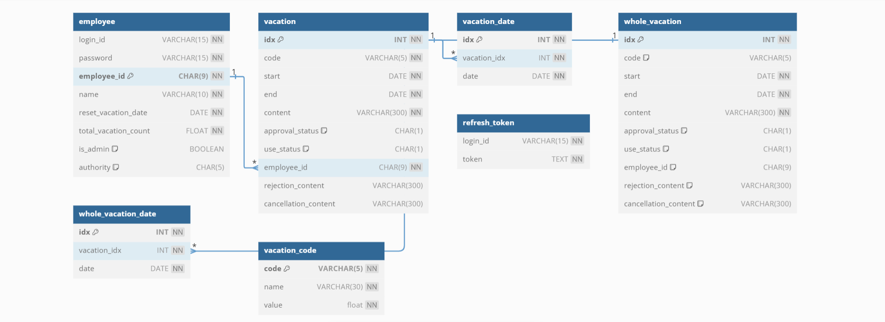
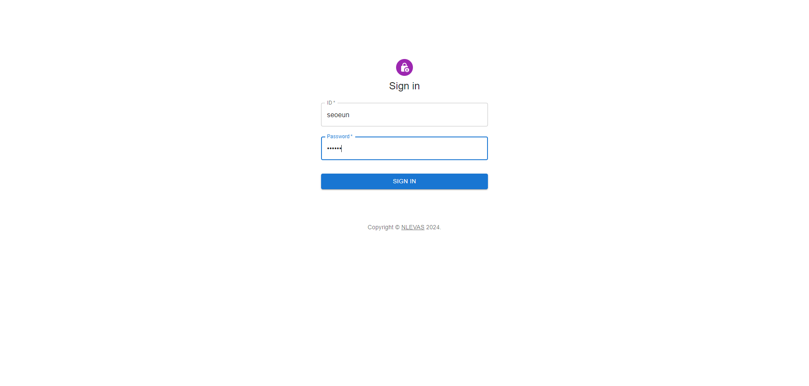
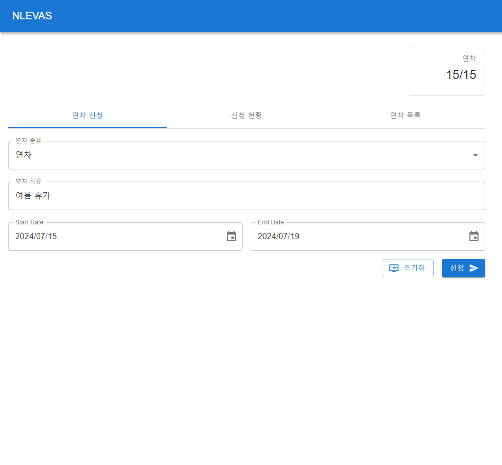
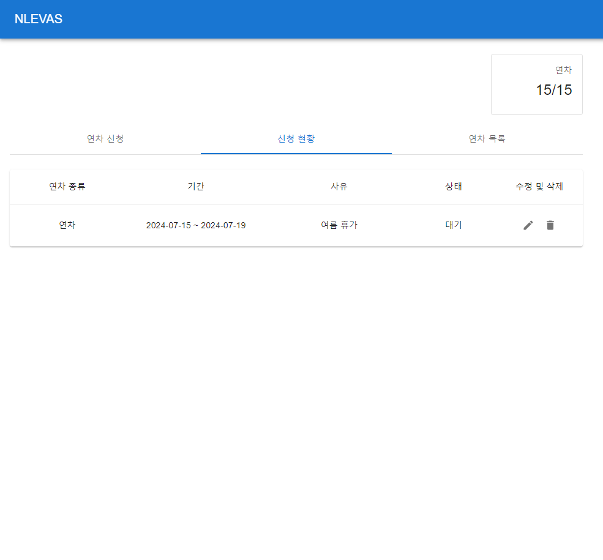
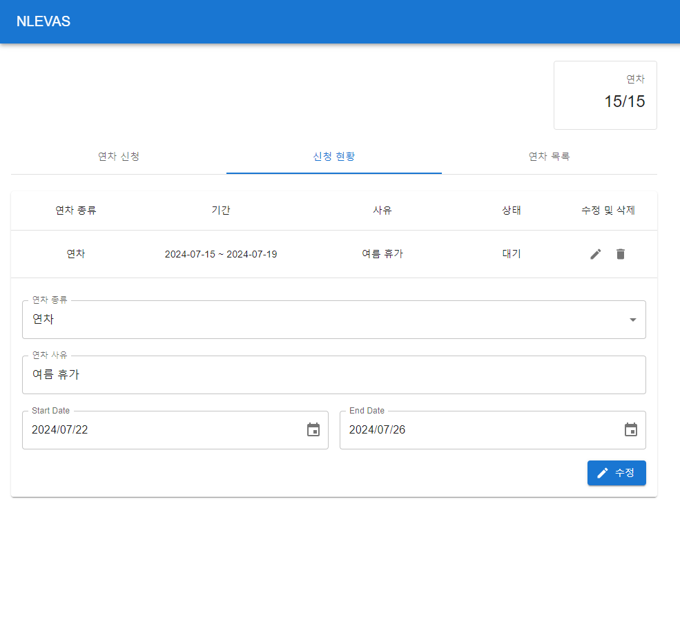
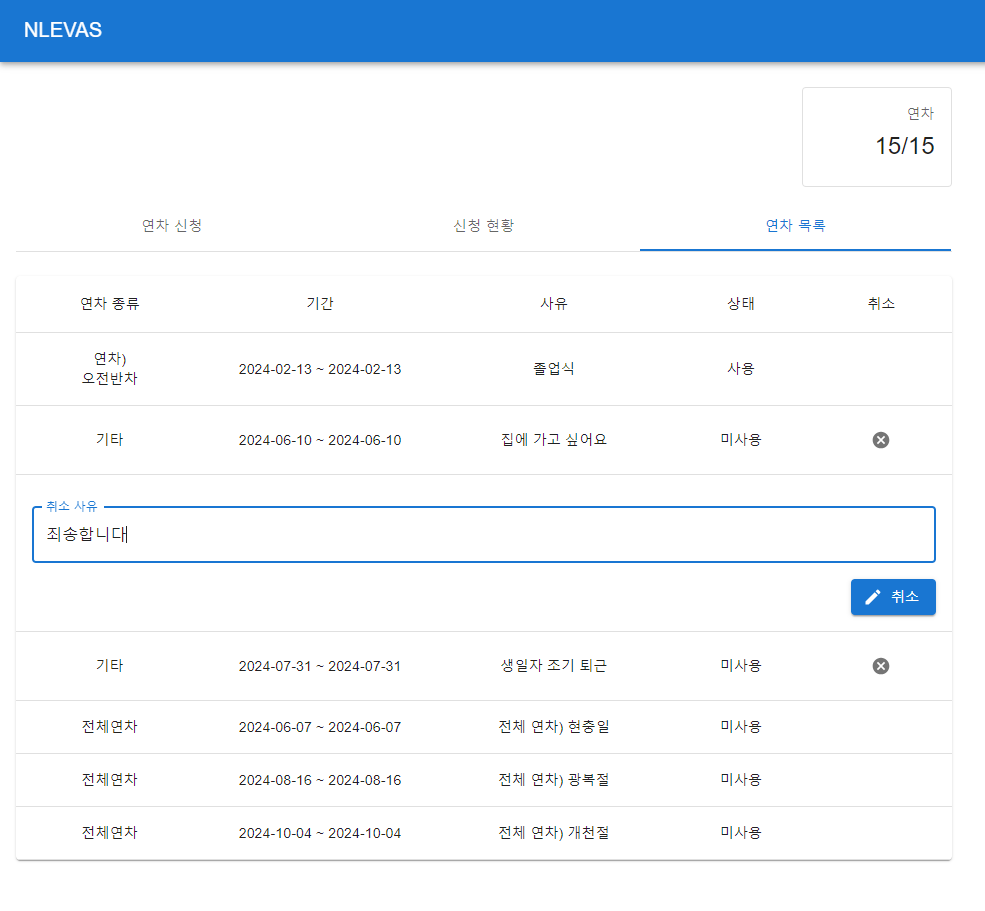
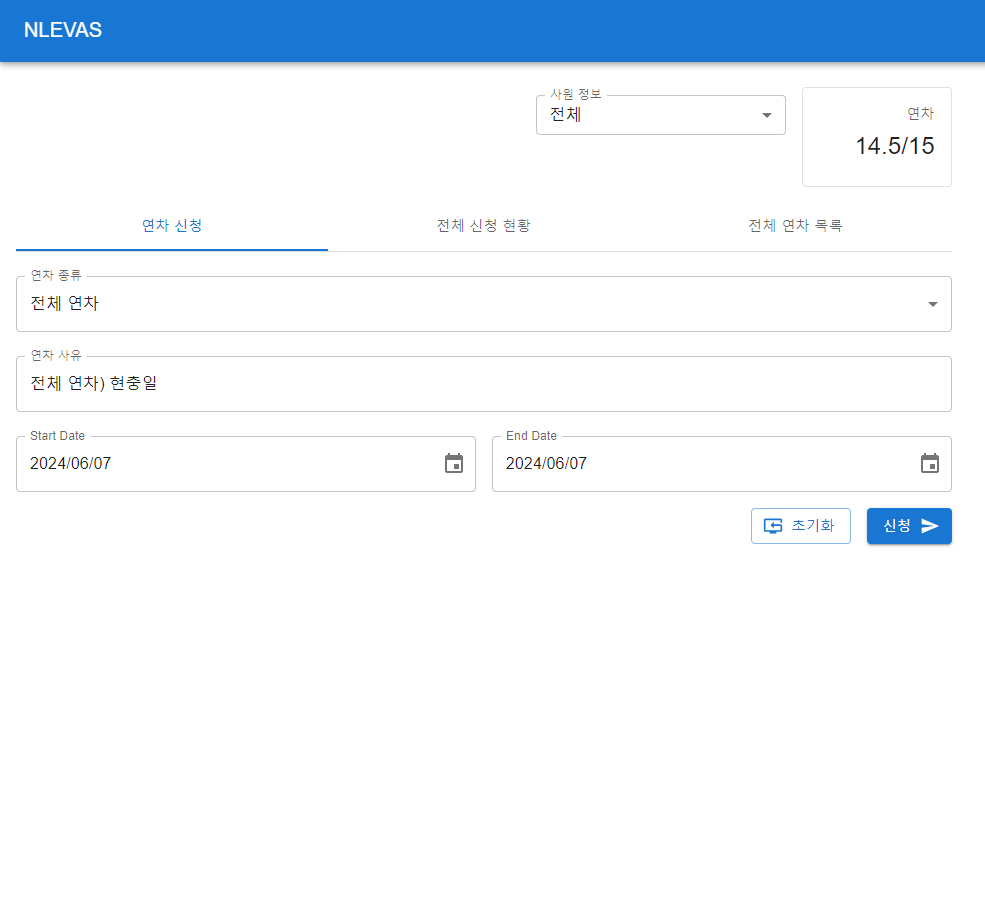
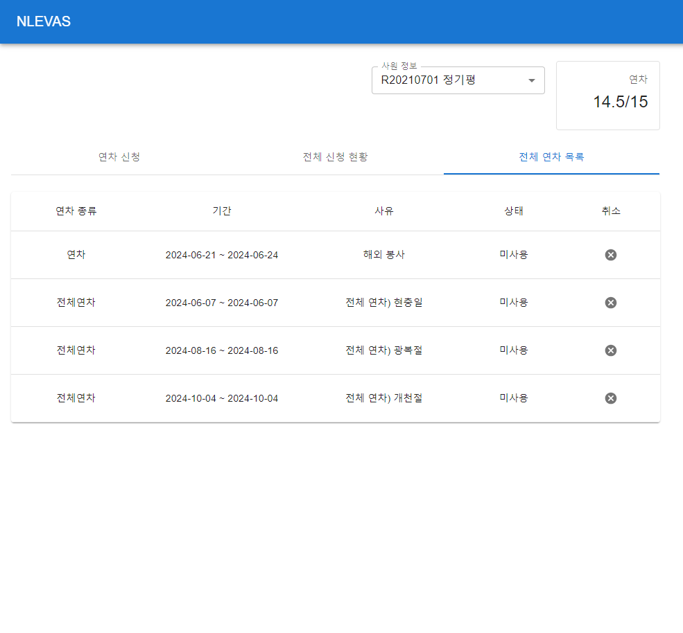
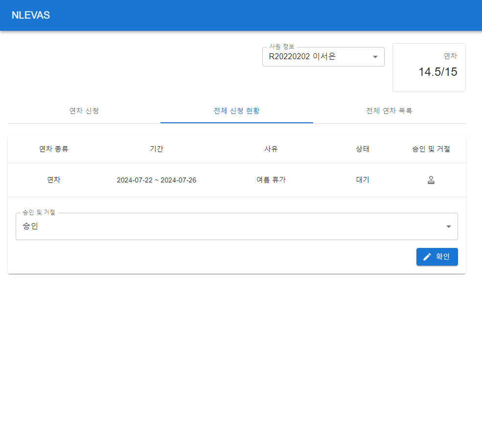
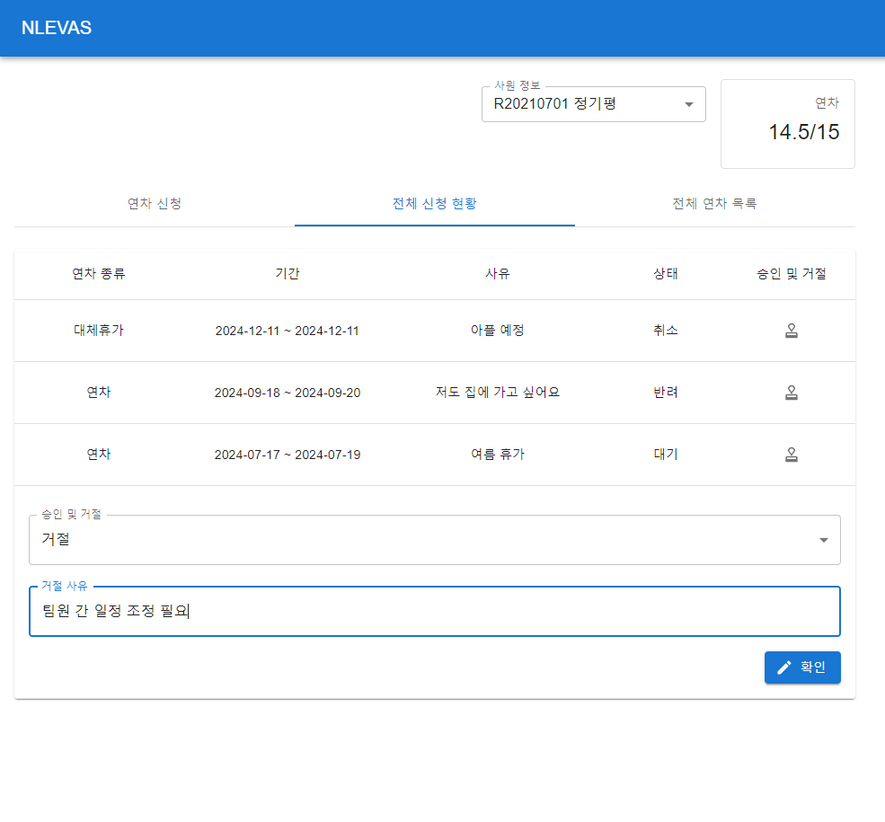

# EVAS(Electronic Vacation Approval System, 연차 전자 결재 시스템)
기존 서면 연차 신청 절차에서 발생했던 승인 지연 문제를 해결하기 위한 연차 전자 결재 시스템 사이드 프로젝트

<br>

## 팀원
|  |  |  |  |
| --- | --- | --- | --- |
| **이서은** | **Back-End** | [**🔗 GitHub**](https://github.com/leeseoeun) | 백엔드 전반에 대한 이해도를 높이기 위하여 해당 프로젝트에서 백엔드 개발을 담당하였습니다. |
| 정기평 | Front-End | [🔗 GitHub](https://github.com/42da) |  |

<br>

## 기술 스택
|  |  |
| --- | --- |
| **Back-End** | **Java, Spring Boot, Spring Security, JWT, MyBatis, MySQL** |
| Front-End | JavaScript, React, HTML/CSS |

<br>

## 데이터베이스 모델링


<br>

- 데이터 모델링 시 휴가 코드 테이블을 분리하여 설계하였습니다.<br>
휴가 유형을 코드화하여 관리하고, 각 코드에는 해당 휴가 유형의 소진 일수를 함께 정의하여 휴가 사용 시 자동 차감 및 정책 변경에 유연하게 대응할 수 있도록 구성하였습니다.

<br>

## [🔗 기능 명세](./functional_specification.md)

<br>

## 구현 기능
### 인증/인가
- Spring Security를 활용한 JWT 기반 인증/인가 구현
- Role 기반 접근 제어를 통한 권한 분리

<br>



<br>

- Spring Security와 JWT 적용 후 /logout 요청에서 refresh token 삭제 로직이 실행되지 않는 문제를 해결하였습니다.<br>
원인을 파악하기 위하여 Spring Security의 필터 체인을 직접 디버깅 하고, /logout 요청 시 내부적으로 /login?logout으로 리다이렉트 되는 기본 동작을 확인하였습니다.<br>
이를 해결하기 위하여 `.logout(AbstractHttpConfigurer::disable)`을 적용해 기본 로그아웃 처리를 비활성화하고, 서비스 레이어에서 refresh token 삭제 후 `SecurityContextLogoutHandler().logout()`을 호출하여 인증 정보를 명시적으로 제거하는 방식으로 로직을 개선하였습니다.
    - **SecurityConfig.java** (핵심 설정 코드)
        ```java
        @Bean
        public SecurityFilterChain filterChain(HttpSecurity http) throws Exception {
            http
            .authorizeHttpRequests((authz) -> authz
                // 로그인, 로그아웃 요청은 인증 없이 허용
                .requestMatchers("/login", "/logout").permitAll()
                .anyRequest().authenticated()
            )
            // Spring Security의 기본 로그아웃 처리 비활성화 (/login?logout으로 리다이렉트 등)
            .logout(AbstractHttpConfigurer::disable)

            return http.build();
        }
        ```
    - **EmployeeController.java**
        ```java
        @PostMapping("logout")
        public void logout(@RequestBody LoginIdForm form, HttpServletRequest request, HttpServletResponse response, Authentication authentication) {
            // 서비스 로직 호출 (refresh token 삭제 및 인증 정보 제거)
            employeeService.logout(form.getLoginId(), request, response, authentication);

            // 응답 상태 코드를 200으로 설정
            response.setStatus(HttpServletResponse.SC_OK);
        }
        ```
    - **EmployeeService.java**
        ```java
        public void logout(String loginId, HttpServletRequest request, HttpServletResponse response, Authentication authentication) {
            // refresh token 삭제
            refreshTokenRepository.delete(loginId);

            // 인증 정보가 존재하는 경우 명시적으로 제거 (로그아웃 처리)
            if (authentication != null) {
                new SecurityContextLogoutHandler().logout(request, response, authentication);
            }
        }
        ```

<br>

### 연차 관리
- 연차 신청, 조회, 수정, 삭제 및 취소 기능 구현
- 사용 연차에 따른 잔여 일수 계산

<br>


<br>

- 서버 부하와 응답 속도를 고려하여 현재 달 기준 ±6개월 내 승인된 연차만 조회하도록 캘린더 API를 설계 및 구현하였습니다.
    - 중복 발생 가능성이 없고, 단순 결합이라는 상황과 성능 저하를 고려하여 UNION ALL을 사용해 개인 연차와 전체 연차를 하나의 결과로 결합
    - GROUP_CONCAT을 사용하여 연차 기간의 날짜들을 쉼표로 연결하고, 개인/전체 연차를 구분할 수 있도록 필드를 추가하여 프론트엔드 요구 사항에 맞는 응답 구조 제공
        - **VacationMapper.xml**
            ```sql
            <select id="findAllCalendar" resultType="Vacation" >
                SELECT res.*
                FROM (
                    -- 개인 연차 데이터 조회
                    (SELECT 
                        v.*, 
                        GROUP_CONCAT(vh.date ORDER BY vh.date SEPARATOR ',') AS date,   -- 연차 기간의 날짜들을 쉼표(,)로 연결하여 하나의 문자열로 생성
                        'N' as is_whole  -- 개인/전체 연차 구분용 필드
                    FROM vacation v 
                    JOIN vacation_date vh ON v.idx = vh.vacation_idx
                    WHERE approval_status IN ('W', 'A')  -- 대기 또는 승인 상태인 연차만 조회
                    AND date BETWEEN DATE_FORMAT(DATE_ADD(NOW(), INTERVAL -6 MONTH), '%Y-%m-01')  -- 현재 기준 6개월 전 첫날
                    AND LAST_DAY(DATE_FORMAT(DATE_ADD(NOW(), INTERVAL 6 MONTH), '%Y-%m-%d'))  -- 현재 기준 6개월 후 마지막 날
                    GROUP BY 
                        v.idx, v.code, v.start, v.end, v.content, v.approval_status, 
                        v.use_status, v.employee_id, v.rejection_content, v.cancellation_content, vh.vacation_idx
                    ORDER BY v.start DESC)
                    
                    UNION ALL
                    
                    -- 전체 연차 데이터 조회
                    (SELECT *, start AS date, 'Y' as is_whole
                    FROM whole_vacation)
                ) AS res;
            </select>
            ```

<br>

#### 사용자
- 연차 신청, 조회(목록), 수정, 삭제, 취소

|||
|-|-|
|▽ 연차 신청|▽ 연차 조회(목록)|
|||
|▽ 연차 수정, 삭제|▽ 연차 취소|
|||

<br>

#### 관리자
- 전체 연차 등록, 조회(목록) 및 취소
- 직원별 연차 신청, 조회(목록), 승인, 거절

|||
|-|-|
|▽ 연차 신청|▽ 연차 조회(목록)|
|||
|▽ 연차 승인|▽ 연차 거절|
|||
