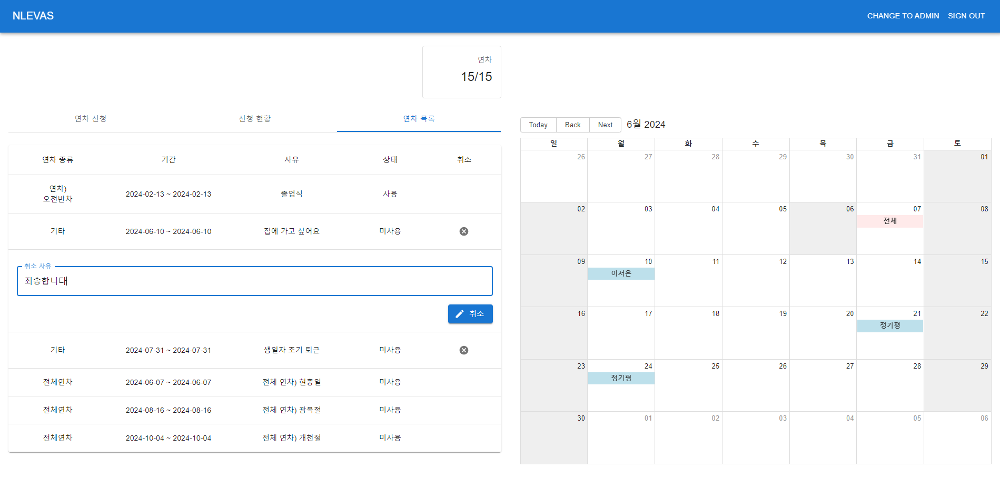

# EVAS *Electronic Vacation Approval System*
연차를 전자 결재로 승인받아 보세요

 

## 팀원 소개
|**이서은**|**정기평**|
|-|-|
|Back-End|Front-End|
|[GitHub](https://github.com/leeseoeun)|[GitHub](https://github.com/42da)|

 

## 사용 기술
|Back-End|Front-End|
|-|-|
|Java|JavaScript|
|Spring Boot, MyBatis|React|
|MySQL||
|Eclipse|Visual Studio Code|

 

## 구현 기능
- 로그인, 로그아웃
    - Spring Security, JWT 이용

  

<b>사용자</b>

- 연차 신청

- 연차 목록

- 연차 수정, 삭제

- 연차 취소

  

<b>관리자</b>

- 전체, 사원 연차 신청

- 전체, 사원 연차 목록

- 연차 승인

- 연차 거절

 

## 데이터베이스 모델링

