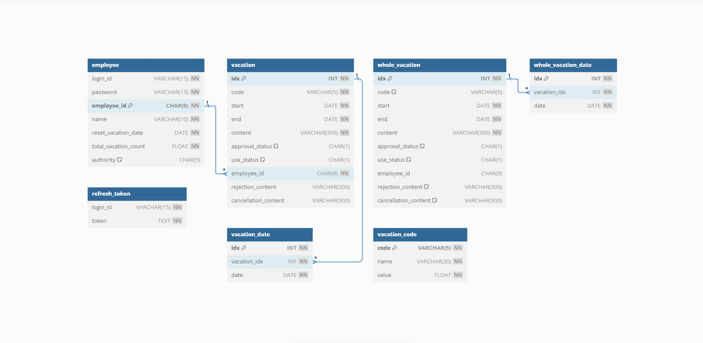

# EVAS
## Electronic Vacation Approval System, 연차 전자 결재 시스템
연차를 전자 결재로 승인받아 보세요!

> 이 프로젝트는 연차를 신청할 때의 불편함을 개선하기 위해 시작되었습니다. 
이전 회사에서 연차를 사용하려면 종이 서류에 담당자의 서명을 직접 받아야 했습니다. 만약, 담당자가 부재중인 경우 서명을 받기 어려운 문제가 있었습니다. 이를 해결하고자 연차 전자 결재 시스템을 개발하게 되었습니다.

 

### 팀원 소개
|이서은|정기평|
|-|-|
|Back-End|Front-End|
|[GitHub](https://github.com/leeseoeun)|[GitHub](https://github.com/42da)|

 

### 사용 기술
||Back-End|Front-End|
|-|-|-|
|**Language**|Java|JavaScript|
|**Framework**|Spring Boot, MyBatis|React|
|**Database**|MySQL||
|**IDE**|Eclipse|Visual Studio Code|

 

### 구현 기능
- **로그인, 로그아웃**
    - Spring Security, JWT 이용

 

- **사용자**

|||
|-|-|
|▽ 연차 신청|▽ 연차 목록|
|||
|▽ 연차 수정, 삭제|▽ 연차 취소|
|||

 

- **관리자**

|||
|-|-|
|▽ 전체, 사원 연차 신청|▽ 전체, 사원 연차 목록|
|||
|▽ 연차 승인|▽ 연차 거절|
|||

<!--  

- <b>로그인, 로그아웃</b>
    - Spring Security, JWT 이용

  

<b>사용자</b>

- 연차 신청

- 연차 목록

- 연차 수정, 삭제

- 연차 취소

  

<b>관리자</b>

- 전체, 사원 연차 신청

- 전체, 사원 연차 목록

- 연차 승인

- 연차 거절
 -->

 

### 데이터베이스 모델링

